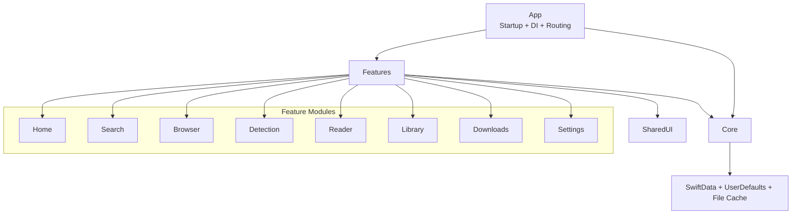
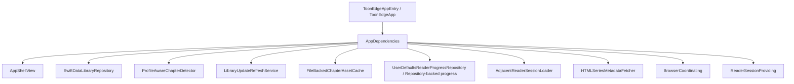
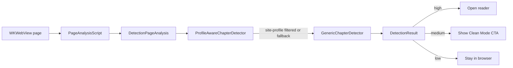
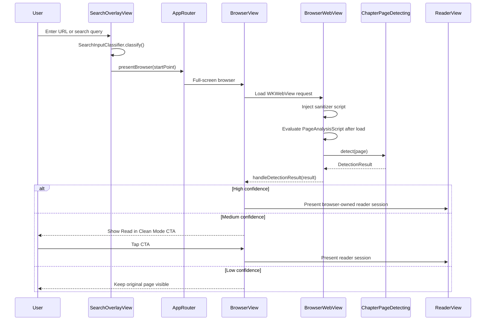
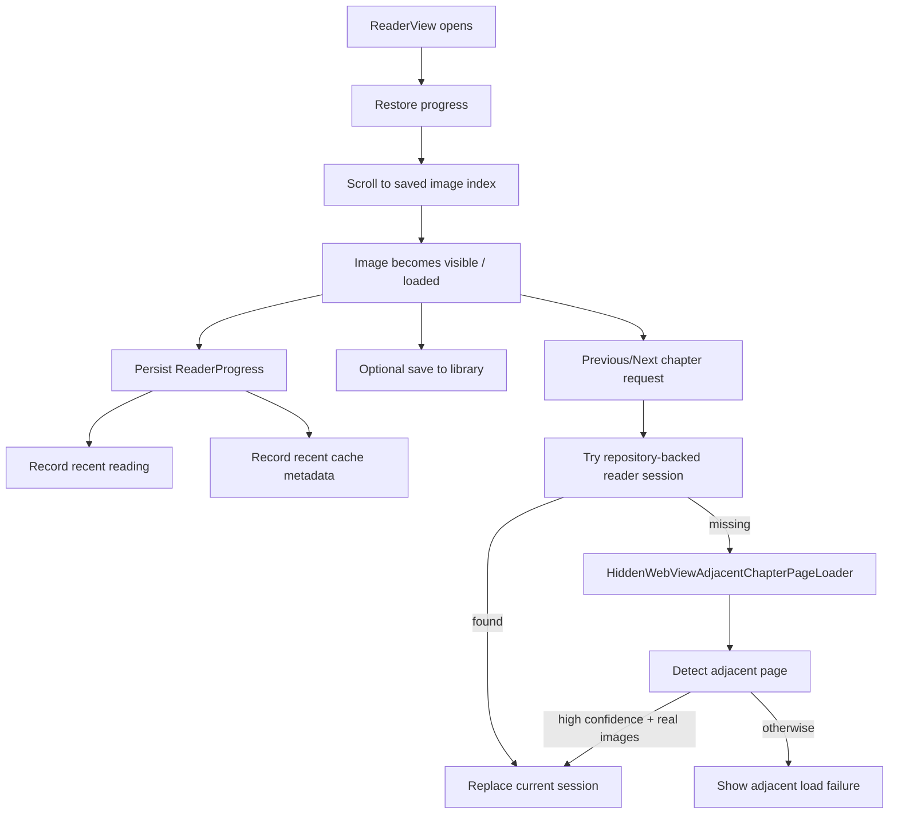
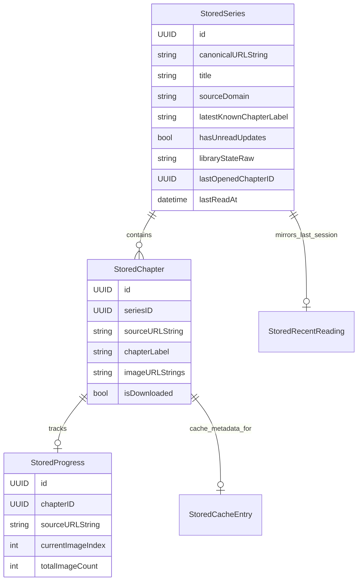
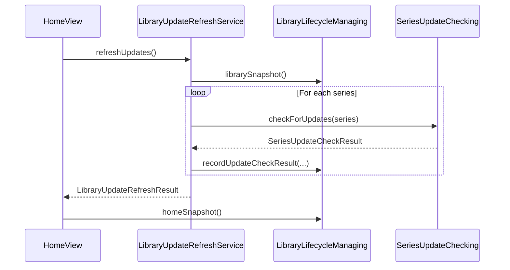
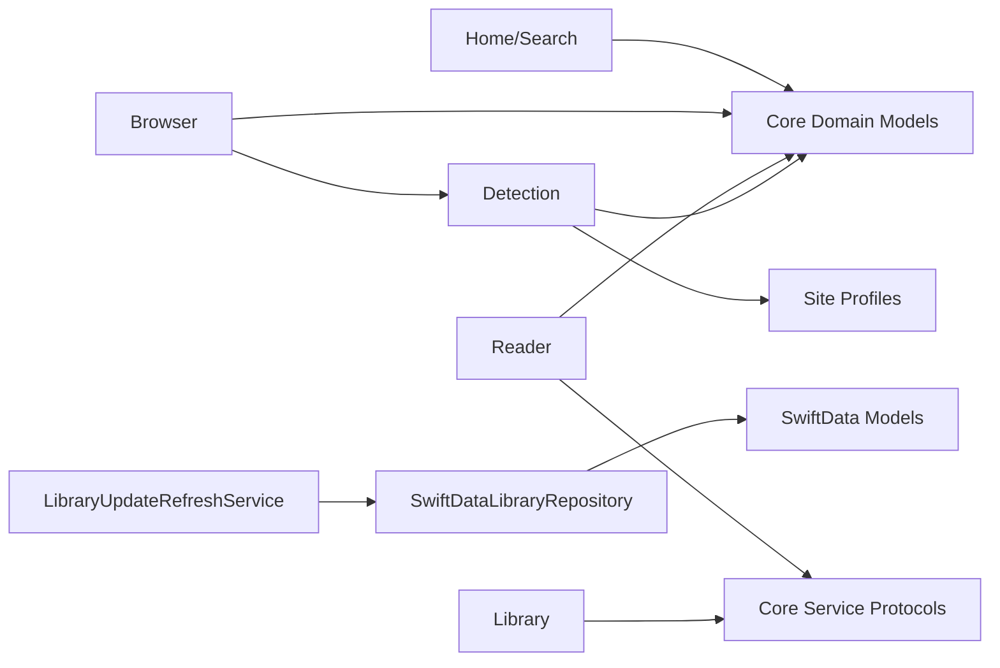

# ToonEdge

## Introduction

This document describes the top-level `ToonEdge` application module as implemented in `app/Sources/ToonEdgeAppCore`. The supplied module tree and core component list were empty, so this documentation is derived from the actual source layout and runtime wiring.

ToonEdge is an iPhone-first reading app that starts from a web search or URL, loads the source page in an in-app browser, runs chapter-page detection after page load, and transitions into a cleaner native reader when confidence is high enough. The module is intentionally local-first: library state, reading progress, recent reading, search history, update checks, and cache metadata are persisted on-device.

For product intent and non-code scope, see the repository source documents instead of repeating them here:

- [Architecture](../docs/architecture.md)
- [PRD](../docs/prd.md)
- [UX Requirements](../docs/ux-requirements.md)
- [UX Brief](../docs/ux-brief.md)

## Module Purpose

`ToonEdgeAppCore` is the application-composition module. It owns:

- app startup and dependency wiring
- app-level routing across Home, Browser, Reader, Library, Downloads, and Settings
- shared domain models used across features
- local persistence and repository-backed services
- the browser-to-detection-to-reader runtime path

It does not act as a backend or hosted catalog. The app is client-side, site-profile aware, and conservative about auto-entering Reader Mode.

## Module Boundaries

The codebase is organized around these top-level areas:

- `App`: startup, dependency injection, shell UI, and router state
- `Core`: shared domain models, persistence models, repositories, and cross-feature services
- `Features`: Home, Search, Browser, Detection, Reader, Library, Downloads, Settings
- `SharedUI`: design system tokens and reusable UI primitives

## Key Entry Points

### Startup and Shell

- `ToonEdgeAppEntry` is the platform app entry point and creates `ToonEdgeRootView` with persistent dependencies when available.
- `ToonEdgeApp` and `ToonEdgeRootView` expose the same app shell for package/library usage.
- `AppShellView` is the composition root for tabs, modal search, full-screen browser, and full-screen reader.

### Dependency Injection

`AppDependencies` is the central integration seam. It carries concrete implementations for:

- library access and lifecycle
- search suggestion and search history
- downloads and cache metadata
- update refresh
- browser preparation
- reader session production
- adjacent chapter loading
- reader progress storage
- chapter detection
- series metadata fetching

This keeps feature views thin and allows mock vs persistent runtime modes without changing feature code.

## Core Runtime Architecture

### Routing Model

`AppRouter` is an app-state router rather than a deep navigation graph. It tracks:

- selected tab
- active sheet
- presented browser start point
- presented reader session
- pending library navigation targets

This design is small but deliberate: feature screens mutate shared routing state, while the shell decides how that state becomes sheets or full-screen covers.

### Shared Domain Model

`AppModels.swift` provides the common language across features:

- search input classification and browser start points
- browser commands
- home and library snapshots
- series and chapter summaries
- library state and identity normalization

This file is effectively the app’s cross-feature contract layer.

## Feature Relationships

### Home and Search

- `HomeView` is search-first and reads a `HomeSnapshot` from `LibraryProviding`.
- Search opens as a sheet via `router.presentSearch()`.
- `SearchOverlayView` classifies text through `SearchInputClassifier`, optionally records history, and routes to the browser with a normalized `BrowserStartPoint`.

### Browser and Detection

- `BrowserView` hosts `BrowserWebView` plus browser chrome and a medium-confidence CTA.
- `BrowserWebView` wraps `WKWebView`, injects a sanitizing script, and runs detection after page load.
- Detection results update `BrowserViewModel`, which decides whether to:
  - auto-open reader inside the browser for high confidence
  - show `Read in Clean Mode` CTA for medium confidence
  - remain in browser for low confidence

### Reader

- `ReaderView` renders chapter image panels and minimal chrome.
- `ReaderViewModel` owns reading progress, chrome state, save-to-library, cache retention, metadata refresh, and adjacent chapter navigation.
- Reader always exposes `View Original Page`, preserving browser fallback.

### Persistence and Local-First State

`SwiftDataLibraryRepository` is the main local data service. It implements multiple protocols instead of splitting storage by feature:

- `LibraryLifecycleManaging`
- `ReaderProgressStoring`
- `SearchHistoryRecording`
- `RecentReadingRecording`
- `CacheMetadataManaging`

This is a pragmatic MVP consolidation point. Features depend on protocols, so repository decomposition is still possible later without changing feature APIs.

## Detection Subsystem

The detection path is split cleanly into extraction, scoring, and profile selection.

### Extraction

`PageAnalysisScript` runs inside the web page and returns:

- page URL and title
- document height and viewport width
- image candidates with geometry and semantic hints
- previous/next chapter links
- challenge-page signals

### Profile Selection

`SiteProfileRegistry` maps hosts to support tiers and compatibility classes:

- `enabledPublic`
- `approvedNonPromoted`
- `browserOnly`

Compatibility classes shape detection strategy:

- `embeddedHTML`
- `hydratedDOM`
- `browserSession`
- `browserOnly`
- `paginatedSinglePage`

### Scoring

`ProfileAwareChapterDetector` decides whether to:

- short-circuit unsupported/browser-only cases
- filter candidates with site-profile selector hints
- request a browser-session follow-up pass
- fall back to generic heuristics

`GenericChapterDetector` then:

- normalizes image candidates
- rejects placeholders, ads, and non-reader shapes
- scores for long vertical image flow, repeated host/path patterns, and chapter-like metadata
- maps score and candidate count into `high`, `medium`, or `low`
- creates a `MockReaderSession` only when a viable image list exists

## Browser to Reader Flow

This is the most important vertical slice in the current system.

## Reader Lifecycle and Adjacent Navigation

The reader is not just a passive image viewer. It also coordinates local continuity.

- progress is restored on session load
- visible/loaded image events update persisted progress
- recent reading is recorded after progress changes
- recent cache metadata is recorded once per session
- the current session can be saved into the library from the reader
- adjacent chapters load from library first, then via hidden-webview detection if necessary

## Persistence Architecture

The local storage model is straightforward and optimized for the current MVP.

### Persistent Entities

`ToonEdgePersistenceModels` registers these SwiftData models:

- `StoredSeries`
- `StoredChapter`
- `StoredProgress`
- `StoredSearchHistory`
- `StoredRecentReading`
- `StoredCacheEntry`

### Repository Responsibilities

`SwiftDataLibraryRepository` is responsible for:

- assembling home and library snapshots
- adding/removing series and chapter records
- recording reading progress and library completion transitions
- restoring `MockReaderSession` values for stored chapters
- saving search history and recent reading
- managing cache metadata entries

### Cache Storage

`FileBackedChapterAssetCache` is the file-backed companion to cache metadata:

- chapter directories are namespaced by source URL
- asset filenames are stable-hashed from original URLs
- cache metadata remains in repository storage, while binary assets live under the cache directory

## Update-Check Flow

Library updates are handled as a local refresh cycle, not a background sync platform.

- `LibraryUpdateRefreshService` fetches the current library snapshot
- it runs a `SeriesUpdateChecking` implementation per series
- each result updates persisted latest-chapter and unread-update state
- aggregate diagnostics can be logged through `UpdateCacheDiagnosticsLogging`

## Dependency Summary

The module’s main dependency directions are:

## Integration Notes

### How This Module Fits the Overall System

- It is the main client application module, not a leaf subsystem.
- It coordinates all user-facing ToonEdge flows from search entry to reading continuity.
- It enforces the product’s local-first architecture by routing almost all durable state through on-device persistence.
- It keeps parsing and detection isolated from SwiftUI views through protocols and feature view models.

### Design Decisions Worth Preserving

- `AppDependencies` is the stability boundary for feature composition.
- `AppRouter` centralizes navigation intent without coupling features to presentation modifiers.
- detection is conservative and confidence-driven, matching product trust requirements
- reader keeps an explicit path back to the source page
- site-profile logic is additive and host-based, with a generic fallback instead of hardcoding a single DOM strategy

## Current Constraints and Extension Points

These behaviors are visible in the current implementation and matter for future maintenance:

- `BrowserRequest` currently turns free-text searches into Google search URLs.
- `SwiftDataLibraryRepository` is a multi-protocol repository; future scale may justify splitting it by concern.
- `MockReaderSession` is still the session payload shape across browser, reader, and repository restoration.
- adjacent chapter loading requires a high-confidence detection result before replacing the current reader session.
- paginated single-page profiles and browser-only profiles are intentionally blocked from clean-mode conversion.

Likely future module-level documentation splits, if the docs set expands, would be:

- [Detection.md](Detection.md)
- [Reader.md](Reader.md)
- [Persistence.md](Persistence.md)
- [Browser.md](Browser.md)

Those files do not exist yet; this document currently serves as the top-level system overview.
